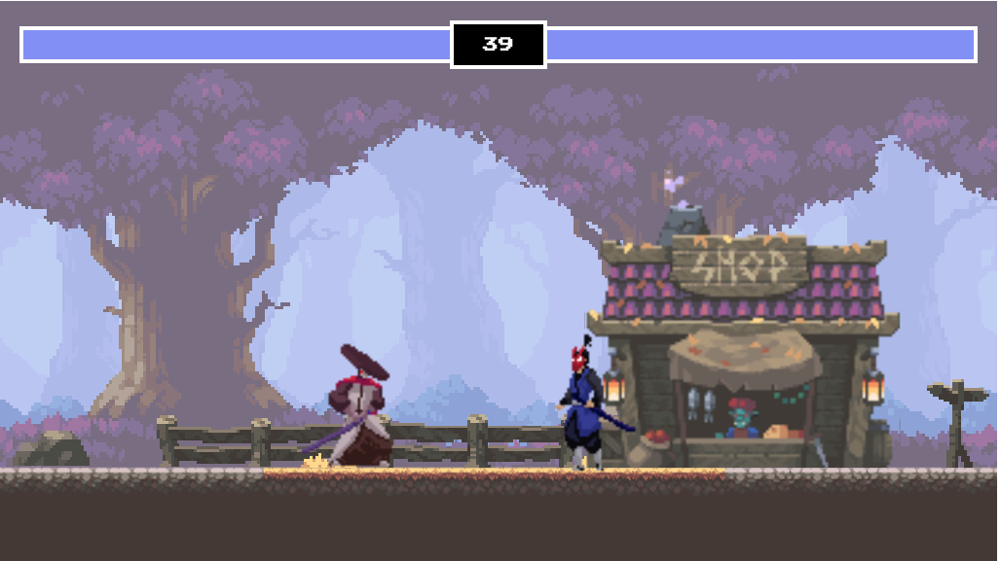

# A fighting game

A good ol' fashioned Kung Fu fighting game. Here's what the game looks like:

Play the game on GitHub pages: https://604adrian.github.io/fighting-game/

## How to play
The controls for Player 1 are as follows:
- __a__: move left
- __b__: move right
- __w__: jump
- __space bar__: attack

The controls for Player 2 are as follows:
- __left arrow__: move left
- __right arrow__: move right
- __up arrow__: jump
- __down arrow__: attack

## Credits
I made this game by following the Youtube tutorial posted by 'Chris Courses'. The tutorial video can be found [here](https://www.youtube.com/watch?v=vyqbNFMDRGQ&list=TLPQMjgwNjIwMjOseK3axPC-Wg&index=7).

All the graphics come from itch.io.

The background image is brullov's _Oak Woods - Environmental Asset_. Check out the itch page [here](https://brullov.itch.io/oak-woods).

The graphics for Player 1 come from LuizMelo's _Martial Hero_. Check out the itch page [here](https://luizmelo.itch.io/martial-hero).

The graphics for Player 2 come from LuizMelo's _Martial Hero 2_. Check out the itch page [here](https://luizmelo.itch.io/martial-hero-2).
